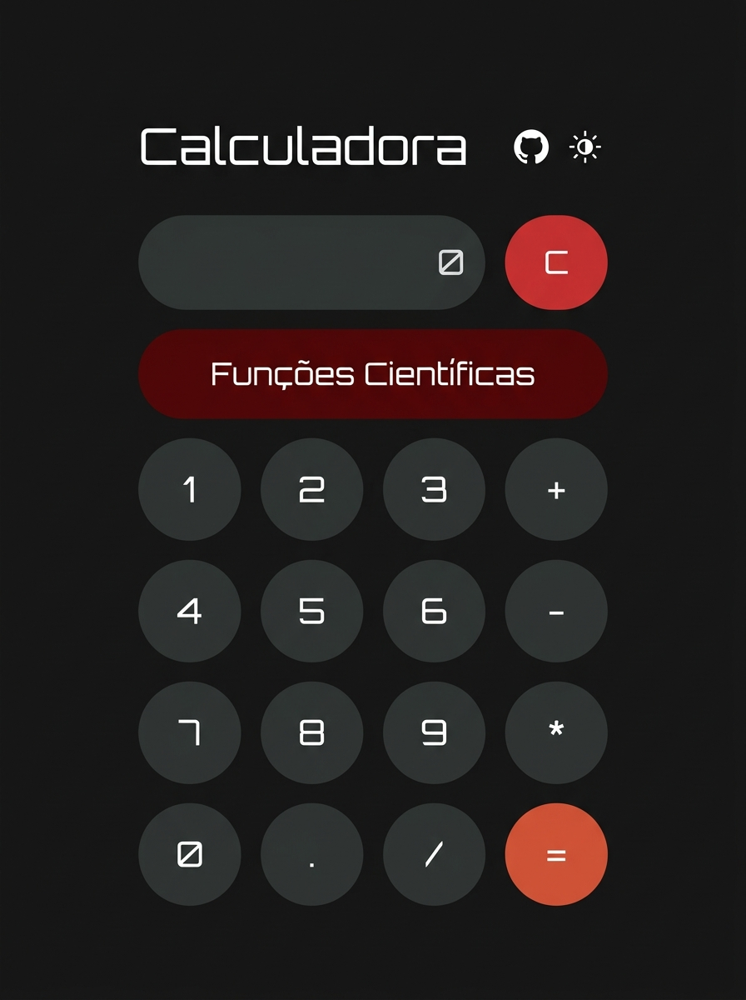
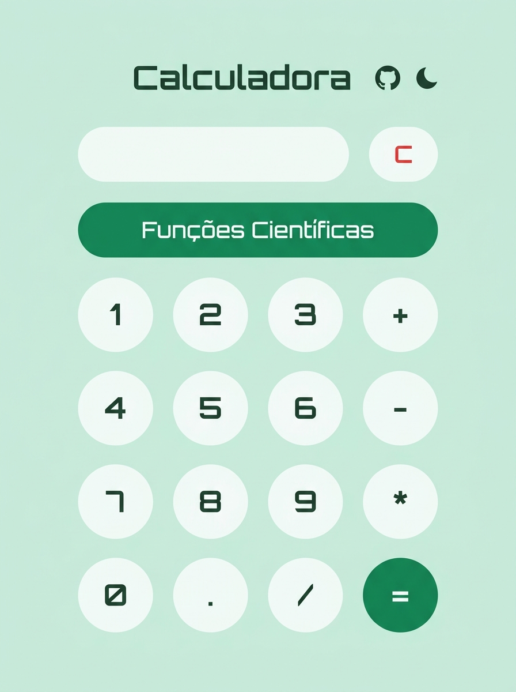

# Calculadora Científica

Calculadora web com funções científicas, alternância de tema (escuro/claro) e suporte a entrada via teclado. Construída com HTML, CSS e JavaScript puro.

  
  &nbsp;&nbsp;&nbsp;
  

## Funcionalidades

- Operações aritméticas básicas (+, -, *, /)
- Funções científicas: sen, √, ^, eˣ, log₁₀, ln
- Painel científico expansível
- Temas escuro e claro com transição animada
- Entrada por teclado (números, operadores, Enter, Backspace)

## Tecnologias

- HTML5 / CSS3 / JavaScript
- Google Fonts (Inter, Orbitron)
- Temas separados em `styles/dark.css` e `styles/light.css`

## Documentação

Veja [DOCUMENTACAO.md](./DOCUMENTACAO.md) para detalhes sobre estrutura, funções e problemas conhecidos.

## Créditos

Favicon: [Freepik - Flaticon](https://www.flaticon.com/free-icons/calculator)